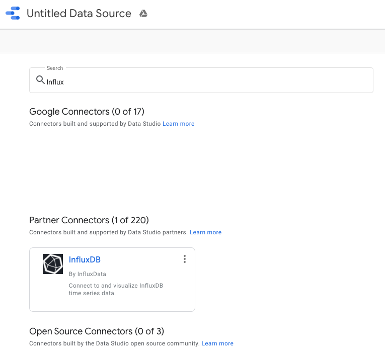
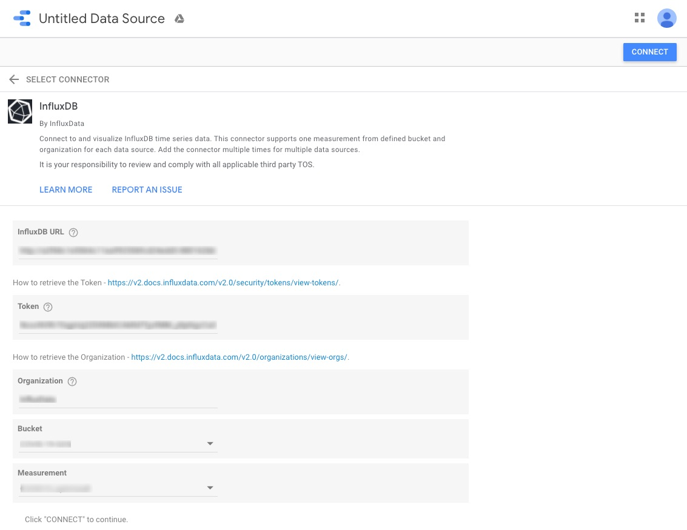
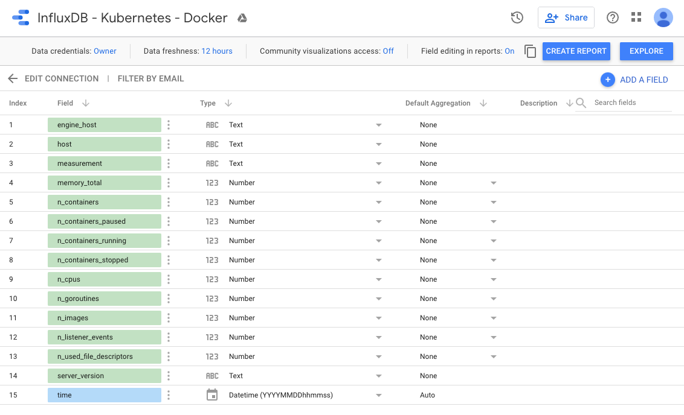
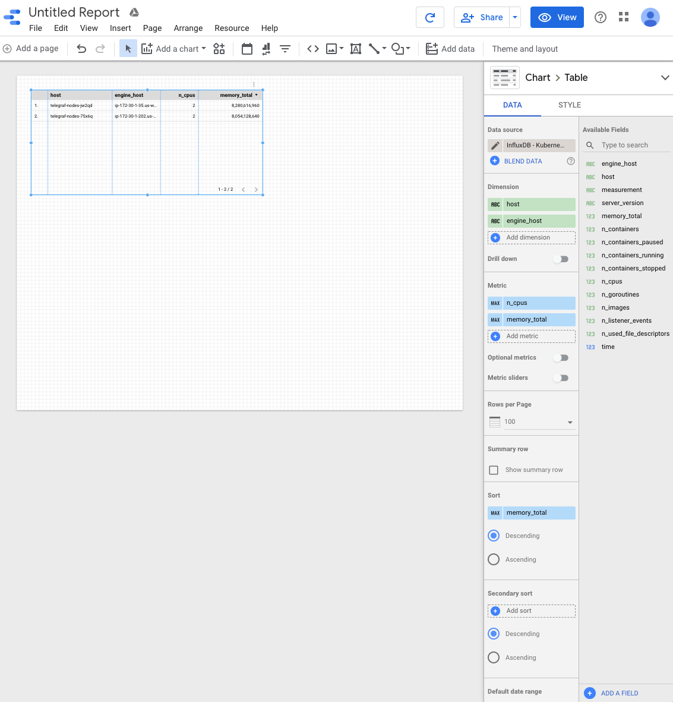
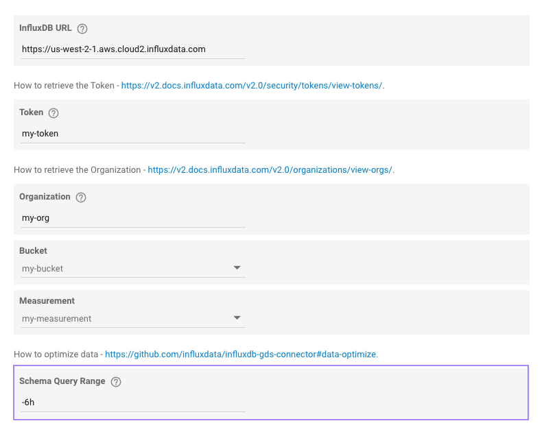

# InfluxDB Connector for Google Data Studio

[](https://circleci.com/gh/influxdata/influxdb-gds-connector)
[](https://codecov.io/gh/influxdata/influxdb-gds-connector)
[](https://github.com/prettier/prettier)
[](https://github.com/influxdata/influxdb-gds-connector/blob/master/LICENSE)
[](https://github.com/influxdata/influxdb-gds-connector/issues)
[](https://github.com/influxdata/influxdb-gds-connector/pulls)
[](https://www.influxdata.com/slack)

*This is not an official Google product.*

This [Data Studio] [Connector] lets users query datasets from [InfluxDB v2] instances through the [InfluxDB API].
## How it works

Connect your InfluxDB to Google Data Studio and start pushing  your data to in minutes.

### How to add the InfluxDB Connector to Data Studio

#### Direct link

To add the InfluxDB Connector in Data Studio you can use this link: 

[](https://datastudio.google.com/u/0/datasources/create?connectorId=AKfycbwhJChhmMypQvNlihgRJMAhCb8gaM3ii9oUNWlW_Cp2PbJSfqeHfPyjNVp15iy9ltCs). 

#### From Data Studio

TBD: If you are already in Data Studio, click the "Create" button and select "Data Source". From there you can search for the InfluxDB Connector.



### Connect your InfluxDB to Data Studio

To access your InfluxDB, enter your Connection information: 

- `InfluxDB URL` 
- `Token` 
- `Organization` 
- `Bucket` 
- `Measurement` 



- [How to retrieve the Organization](https://v2.docs.influxdata.com/v2.0/organizations/view-orgs/)
- [How to retrieve the Token](https://v2.docs.influxdata.com/v2.0/security/tokens/view-tokens/)

#### Set up Metrics

Once you are connected, Data Studio will show you a list of all the fields available from your **Measurement**. 
This includes your _Tag set_, _Field set_ and _Timestamp_. 



### Visualize your data in Data Studio

After you have reviewed the fields, press "CREATE REPORT" button to create your report. 



## Inspiration

- [COVID-19 report powered by InfluxDB](/examples/)

## InfluxDB 1.8 compatibility

[InfluxDB 1.8.0 introduced forward compatibility APIs](https://docs.influxdata.com/influxdb/v1.8/tools/api/#influxdb-20-api-compatibility-endpoints) for InfluxDB 2.0. This allow you to easily move from InfluxDB 1.x to InfluxDB 2.0 Cloud or open source.

Connector usage differences:
1. Use the form `username:password` for an **authentication token**. Example: `my-user:my-password`. Use an empty string (`""`) if the server doesn't require authentication.
1. The organization parameter is not used. Use a string `-` as a value.

## Troubleshooting

### This app isn't verified

When authorizing the connector, an OAuth consent screen may be presented to you with a warning "This app isn't verified". 
This is because the connector has requested authorization to make requests to an external API (E.g. to fetch data from the service you're connecting to). 

> This warning will no longer be display after the connector will include in Partner connectors gallery - see [#2](https://github.com/influxdata/influxdb-gds-connector/issues/2)

### Data optimize

The connector uses two types of query: `schema query` and `data query`. 
Please, check that both of them correctly works with your dataset.

#### Schema query

It is used to determine all your fields from configured `Bucket` and `Measurement`. The query is used only in the configuration.

```flux
import "influxdata/influxdb/v1"

bucket = "my-bucket"
measurement = "my-measurement"
start_range = duration(v: uint(v: 1970-01-01) - uint(v: now()))

v1.tagKeys(
  bucket: bucket,
  predicate: (r) => r._measurement == measurement,
  start: start_range
) |> filter(fn: (r) => r._value != "_start" and r._value != "_stop" and r._value != "_measurement" and r._value != "_field")
  |> yield(name: "tags")

from(bucket: bucket)
  |> range(start: start_range)
  |> filter(fn: (r) => r["_measurement"] == measurement)
  |> keep(fn: (column) => column == "_field" or column == "_value")
  |> unique(column: "_field")
  |> yield(name: "fields")
```

You can optimize this query by `Schema Query Range` configuration in first step of Data Studio connection wizard:



then the `start_range` of query will be `-6h`.

#### Data query

It is used for retrieve data from InfluxDB. 
The time-range is configured via [Date Range Control Widget](https://support.google.com/datastudio/answer/6291067?hl=en).

```flux
bucket = "my-bucket"
measurement = "my-measurement"
// Configure DataRange in Data Studio - https://support.google.com/datastudio/answer/6291067?hl=en
start = time(v: 1) // or start of specified Data Range
stop = now() // or end of specified Data Range

from(bucket: bucket) 
|> range(start: start, stop: stop) 
|> filter(fn: (r) => r["_measurement"] == measurement) 
|> pivot(rowKey:["_time"], columnKey: ["_field"], valueColumn: "_value")
```

[Data Studio]: https://datastudio.google.com
[Connector]: https://developers.google.com/datastudio/connector
[InfluxDB v2]: https://www.influxdata.com/products/influxdb-overview/influxdb-2-0/
[InfluxDB API]: https://v2.docs.influxdata.com/v2.0/reference/api/

## Development

- Test version of the Connector: [AKfycbySDF4eD7wmA_awZ6aoCwENuXs1Opw_T0DIJ8F](https://datastudio.google.com/u/0/datasources/create?connectorId=AKfycbySDF4eD7wmA_awZ6aoCwENuXs1Opw_T0DIJ8F-MVI)
- Production version of the Connector: [AKfycbwhJChhmMypQvNlihgRJMAhCb8gaM3ii9oUNWlW_Cp2PbJSfqeHfPyjNVp15iy9ltCs](https://datastudio.google.com/u/0/datasources/create?connectorId=AKfycbwhJChhmMypQvNlihgRJMAhCb8gaM3ii9oUNWlW_Cp2PbJSfqeHfPyjNVp15iy9ltCs)

Open Apps Script project in your browser:

```bash
$ yarn open
```

or

https://script.google.com/home/projects/18YPFhvO1TMR7QFCw2iFuIH_1_iPvFIYrnT3fg8J7skoqUd5x7YAnPD7_/edit

Push your local changes to Apps Script:

```bash
$ yarn push
```

Update the production deployment of connector:

```bash
$ yarn deploy
```

## Contributing

Bug reports and pull requests are welcome on GitHub at https://github.com/influxdata/influxdb-gds-connector.

## License

The gem is available as open source under the terms of the [MIT License](https://opensource.org/licenses/MIT).

