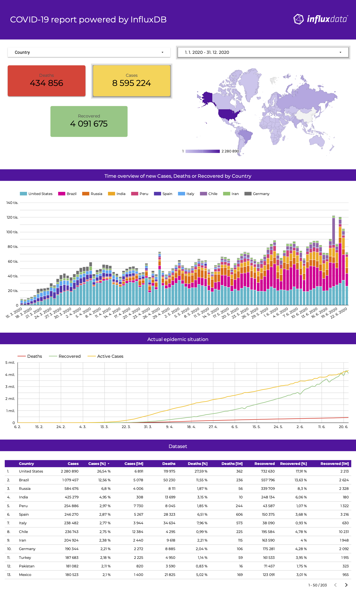
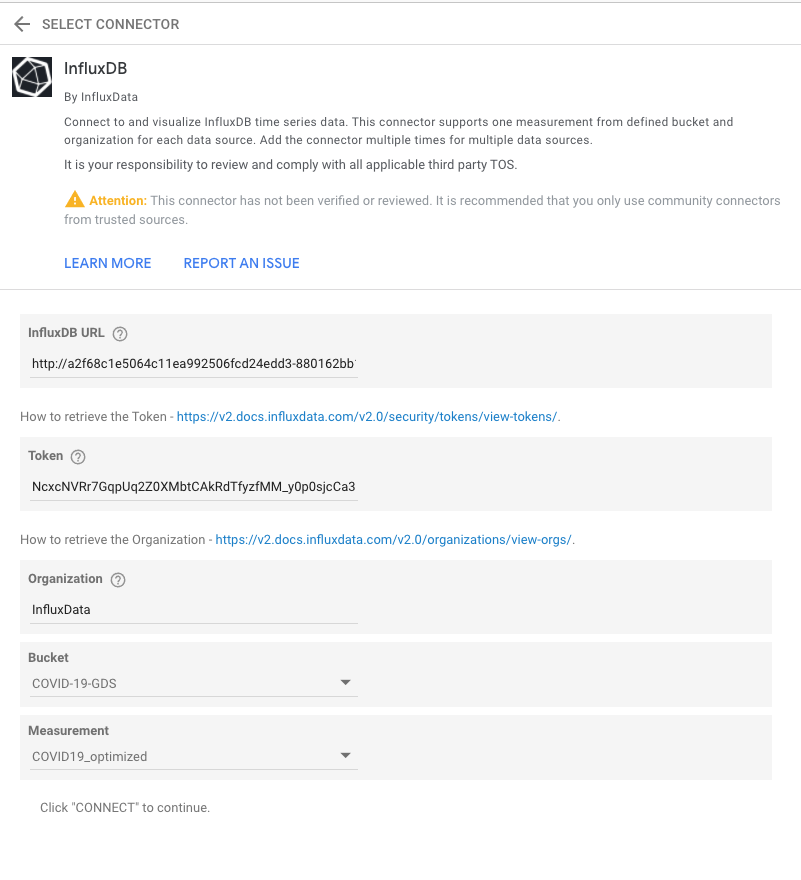
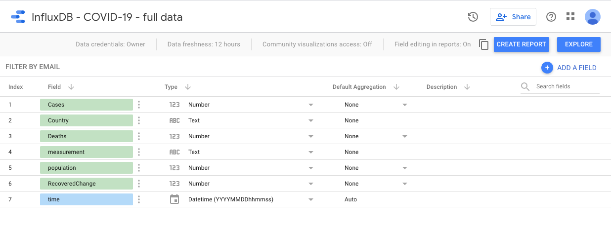

# COVID-19 report powered by InfluxDB

This example shows how to create a report in [Google Data Studio](https://datastudio.google.com/s/p19vh-b82Sw) where is as a source use InfluxDB. 

The following image shows how will finished report looks like:

[](https://datastudio.google.com/s/p19vh-b82Sw) 

## Data set

As a dataset we will use there different sources:

### 1. Confirmed cases and deaths

- source: [Our World in Data - COVID-19](https://github.com/owid/covid-19-data/blob/master/public/data/ecdc/full_data.csv) 

```csv
date,location,new_cases,new_deaths,total_cases,total_deaths
...
2020-03-04,United States,22,3,125,9
2020-03-05,United States,34,2,159,11
2020-03-06,United States,74,1,233,12
2020-03-07,United States,105,2,338,14
2020-03-08,United States,95,3,433,17
2020-03-09,United States,121,4,554,21
2020-03-10,United States,200,5,754,26
2020-03-11,United States,271,2,1025,28
2020-03-12,United States,287,2,1312,30
2020-03-13,United States,351,10,1663,40
2020-03-14,United States,511,7,2174,47
2020-03-15,United States,777,10,2951,57
2020-03-16,United States,823,12,3774,69
...
```

### 2. World population

- source: [Our World in Data - COVID-19](https://github.com/owid/covid-19-data/blob/master/public/data/ecdc/locations.csv)

```csv
countriesAndTerritories,location,continent,population_year,population
...
Brunei_Darussalam,Brunei,Asia,2020,437483
Bulgaria,Bulgaria,Europe,2020,6948445
Burkina_Faso,Burkina Faso,Africa,2020,20903278
Burundi,Burundi,Africa,2020,11890781
Cambodia,Cambodia,Asia,2020,16718971
Cameroon,Cameroon,Africa,2020,26545864
Canada,Canada,North America,2020,37742157
Cape_Verde,Cape Verde,Africa,2020,555988
Cases_on_an_international_conveyance_Japan,International,,,
Cayman_Islands,Cayman Islands,North America,2020,65720
Central_African_Republic,Central African Republic,Africa,2020,4829764
Chad,Chad,Africa,2020,16425859
...
```

### 3. Recovered cases

- source: [Bing COVID-19 data - recovered cases from all regions](https://github.com/microsoft/Bing-COVID-19-Data/blob/master/data/Bing-COVID19-Data.csv)

```csv
ID,Updated,Confirmed,ConfirmedChange,Deaths,DeathsChange,Recovered,RecoveredChange,Latitude,Longitude,ISO2,ISO3,Country_Region,AdminRegion1,AdminRegion2
...
7166452,03/30/2020,3001,184,29,6,11,0,49.73911,15.3315,CZ,CZE,Czechia,,
7166454,03/31/2020,3308,307,36,7,45,34,49.73911,15.3315,CZ,CZE,Czechia,,
7166456,04/01/2020,3589,281,44,8,61,16,49.73911,15.3315,CZ,CZE,Czechia,,
7166458,04/02/2020,3858,269,49,5,67,6,49.73911,15.3315,CZ,CZE,Czechia,,
7166461,04/03/2020,4190,332,58,9,71,4,49.73911,15.3315,CZ,CZE,Czechia,,
7166464,04/04/2020,4472,282,66,8,78,7,49.73911,15.3315,CZ,CZE,Czechia,,
7166467,04/05/2020,4587,115,78,12,96,18,49.73911,15.3315,CZ,CZE,Czechia,,
7166470,04/06/2020,4822,235,85,7,121,25,49.73911,15.3315,CZ,CZE,Czechia,,
7166473,04/07/2020,5017,195,94,9,172,51,49.73911,15.3315,CZ,CZE,Czechia,,
7166476,04/08/2020,5312,295,108,14,181,9,49.73911,15.3315,CZ,CZE,Czechia,,
...
```

#### How to import

If we assumed that the files are store in `/usr/src/data`, than can be imported by:

```bash
influx write --header=#datatype dateTime:2006-01-02,tag,long,long,long,long --header=#constant measurement,covid_full_data \ 
    --file /usr/src/data/full_data.csv --skipRowOnError

influx write --header=#datatype tag,tag,tag,dateTime:2006,long --header=#constant measurement,covid_locations \
    --file /usr/src/data/locations.csv --skipRowOnError

influx write --header=#datatype ignored,dateTime:01/02/2006,ignored,ignored,ignored,ignored,long,long,ignored,ignored,tag,tag,tag,tag,tag \
    --header=#constant measurement,covid_Bing-COVID19-Data --file /usr/src/data/Bing-COVID19-Data.csv --skipRowOnError
```

## Configure InfluxDB Connector

### Configure connection

1. https://datastudio.google.com/u/0/datasources/create?connectorId=AKfycbwhJChhmMypQvNlihgRJMAhCb8gaM3ii9oUNWlW_Cp2PbJSfqeHfPyjNVp15iy9ltCs
1. Fill `URL`, `Token`, `Organization`, `Bucket` and `Measurement`



### Confirm following schema



After confirmation of schema we are able to create report by "Create Report" button.

## Performance

Originally we used Google Data Studio features to joint data together - [data blending](https://support.google.com/datastudio/answer/9061420?hl=en&ref_topic=9061419), but it caused a performance issue.

Every "widget" on the Google Data Studio Page uses connector to fetch data and we had a separate connector for each measurement:

> 3 measurement x 8 widget = 24 connection to InfluxDB + Data Blending overhead for each refresh    

## Links

- Create your Report: [https://datastudio.google.com/u/0/datasources/create?connectorId=AKfycbwhJChhmMypQvNlihgRJMAhCb8gaM3ii9oUNWlW_Cp2PbJSfqeHfPyjNVp15iy9ltCs](https://datastudio.google.com/u/0/datasources/create?connectorId=AKfycbwhJChhmMypQvNlihgRJMAhCb8gaM3ii9oUNWlW_Cp2PbJSfqeHfPyjNVp15iy9ltCs)

